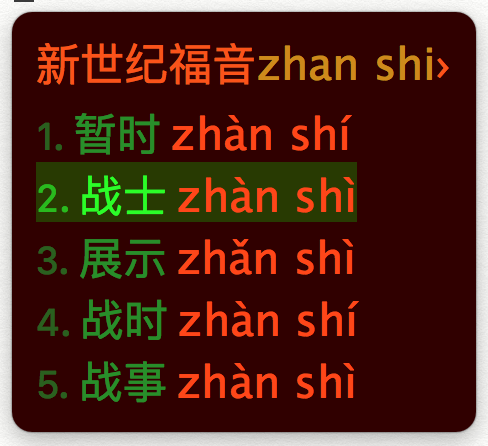

# Rime中州韵输入法-地球拼音带调小鹤双拼-EVA配色

这是一个整合了我制作的基于地球拼音的小鹤双拼方案和EVA配色的Rime中州韵输入法配置方案。

和Rime自带的基于朙月拼音的小鹤双拼不同，基于地球拼音的小鹤双拼可以使用;/,\符号为1234声选择候选字。我修改了[zaqzrh分享的小鹤双拼方案](https://github.com/zaqzrh/Tone-double_pinyin)以在候选框中显示拼音而不是五笔反查。使用方法为把这个Repo的.yaml文件复制到用户本地的Rime配置文件夹，覆盖原文件即可。在覆盖前记得备份原文件。复制文件后需要在default.custom.yaml中加入下列语句以将本方案激活：
```yaml
patch:
  schema_list:
  - schema: td_rl_pinyin_flypy
```
为了确保不显示五笔反查，建议复制文件后将Rime配置文件夹中的.bin文件全部删除，再重新Deploy输入法，应该就没有问题了。

EVA的配色调教使用了[Rime西米](http://kylebing.cn/tools/rime_skin_editor/)配色工具，参考了[jyota的Vim的EVA配色](http://vimcolors.com/341/eva/light)和[karminski的Sublime的EVA配色](https://github.com/karminski/EVA-theme).

在Mac OSX 10.13.5 及 Rime 0.9.26.2 上测试没有问题。


EVA配色的效果图如下：

